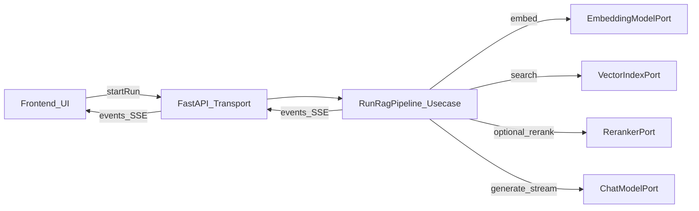

## Architecture (strict decoupling)

- **Backend**: FastAPI is transport only; it delegates to application/use-cases. No Ollama/FS details leak into domain/use-cases.
- **Frontend**: Vite + React. UI is split into (1) chat/interaction view and (2) pipeline graph visualizer; UI consumes a streaming event protocol.
- **Scenarios**: stored as local YAML/JSON files and loaded through a backend `ScenarioRepository` port with a filesystem adapter.

### Backend layering (Python)

- **Domain** (`backend/src/domain/`)
  - Core types: `Scenario`, `PipelineSpec`, `NodeId`, `RunId`, `ChatTurn`, `DocumentChunk`, `EmbeddingVector` (opaque), `RetrievalResult`, `RerankResult`, `ModelToken`.
  - Invariants/validation: scenario schema validation (ids unique, graph is DAG or permitted cycles), pipeline toggles validity.
  - Execution events (domain model): `PipelineEvent` union (node_started, node_progress, node_completed, node_error) with timestamps and optional payload handles.
- **Ports** (`backend/src/domain/ports/`)
  - `EmbeddingModelPort`: `embed(texts: list[str]) -> list[Vector]`
  - `ChatModelPort`: `generate(prompt, stream=True) -> token stream + final text`
  - `VectorIndexPort`: `search(query_vector, top_k, filters) -> list[RetrievalResult]`
  - `RerankerPort` (optional): `rerank(query, candidates) -> list[RerankResult]`
  - `ScenarioRepositoryPort`: `list/get/load/save` scenarios
  - `ClockPort`, `IdGeneratorPort` (for deterministic playback/testing)
- **Use-cases** (`backend/src/usecases/`)
  - `RunRagPipeline`: orchestrates a run from user query to final answer; emits `PipelineEvent`s as it progresses.
  - `LoadScenario`, `ListScenarios`, `ValidateScenario`.
  - `BuildRunTimeline`: converts low-level events into a playback-friendly timeline (step index, node focus, guidance text).
- **Adapters** (`backend/src/adapters/`)
  - `ollama/` adapters implementing `EmbeddingModelPort` and `ChatModelPort` via Ollama HTTP.
  - `scenario_fs/` filesystem adapter for scenario YAML/JSON.
  - `vector/` implementation:
    - MVP: in-memory index built from scenario documents + chunking.
    - Next: pluggable vector DB (Chroma/FAISS) behind `VectorIndexPort`.
  - `rerank/`:
    - MVP: off (no-op) adapter.
    - Later: local cross-encoder or LLM-based rerank behind `RerankerPort`.
- **Transport** (`backend/src/transport/http/`)
  - REST endpoints for scenarios + run start.
  - **Streaming** endpoint for events using **SSE** (recommended for simplicity): one run = one event stream.
  - DTO mapping only here (Pydantic models), converting to/from domain types.

### Frontend layering (TypeScript)

- **UI** (`frontend/src/ui/`)
  - `layout/WorkspaceSplit.tsx`: two-panel layout (left chat, right graph).
  - `chat/ChatPanel.tsx`: input, transcript, final answer, intermediate outputs toggles, guided explanation view.
  - `graph/PipelineGraph.tsx`: node graph, real-time highlighting, click-to-inspect node.
  - `inspector/NodeInspector.tsx`: shows per-node inputs/outputs/latency/metadata.
  - `playback/PlaybackControls.tsx`: pause/resume/step, speed slider.
- **Application state** (`frontend/src/usecases/`)
  - `useRunController()`: connects to SSE, stores event timeline, exposes playback controls and derived UI state.
  - `useScenarioController()`: loads scenarios, selects current scenario.
- **Adapters** (`frontend/src/adapters/`)
  - `api/httpClient.ts`: fetch + SSE client.
  - DTO mapping from transport events to internal types.

## Real-time visualization + playback design

- **Event protocol** (transport DTO, versioned):
  - `run_started`, `node_started`, `node_output` (chunked/streaming), `node_completed`, `token`, `run_completed`, `error`.
  - Each event includes: `runId`, `nodeId`, `seq`, `t_ms`, `kind`, plus payload.
- **Playback**
  - Always record the full event log.
  - A playback cursor replays events at adjustable speed; stepping advances to the next “significant” event (node boundary by default).
  - Pause stops UI advancement but continues buffering events (or optionally backpressure by pausing generation—future enhancement).
- **Guided explanation**
  - For each node kind (ingest, preprocess, embed, retrieve, rerank, generate) provide a beginner-friendly template.
  - Use-cases attach a `guidance` field in events (or a separate `explanation` stream) derived from domain node type + current inputs.

## Modular pipeline + swapping components

- `PipelineSpec` defines nodes and edges with typed configs, e.g.:
  - Chunking strategy, embedding model name, retrieval top_k, hybrid vs vector-only retrieval, rerank on/off.
- Use-case composes a concrete `PipelineRuntime` by selecting adapters based on scenario config (composition at the edge).

## UI design system compliance

- Follow `frontend/DESIGN.md` tokens and the `.cursor/rules/design-system-precision.mdc` principles.
- Two-panel split uses **surface tonal hierarchy + spacing** (avoid default 1px borders); use `surface-container-`* tokens for panels.
- Chips/tags use small radii (`rounded-sm`/`rounded-md`), no pure black text.

## Minimal MVP vs follow-ups

- **MVP**
  - Single scenario with local documents.
  - Chunking + embeddings via Ollama.
  - In-memory vector search.
  - Gemma 3 1B generation via Ollama, with token streaming.
  - SSE event stream + UI playback and node inspector.
- **Follow-ups**
  - Scenario editor UI, import docs, vector DB adapter.
  - Reranking adapter.
  - Run persistence + export/import run traces.
  - Deterministic simulation mode (no model calls) for teaching.

## Suggested repo layout

- `backend/`
  - `src/domain/`, `src/usecases/`, `src/adapters/`, `src/transport/http/`, `src/infra/` (wiring)
- `frontend/`
  - `src/ui/`, `src/usecases/`, `src/adapters/`, `src/shared/`
- `scenarios/`
  - `*.yaml` scenario definitions + local documents referenced by relative paths

## Mermaid (end-to-end flow)

